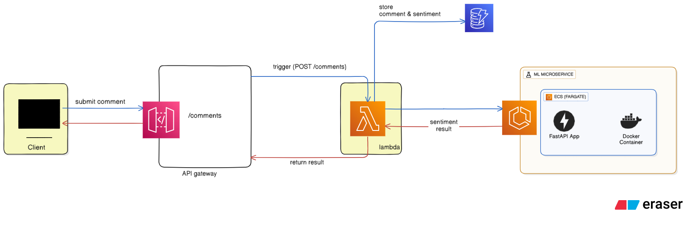
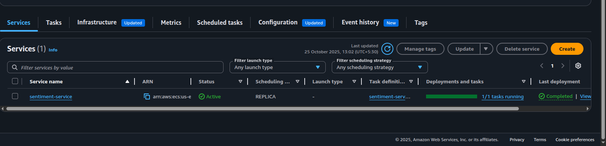
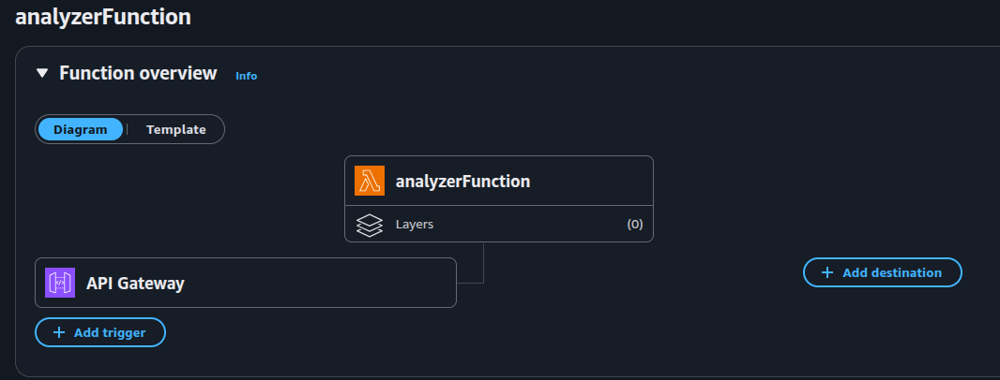
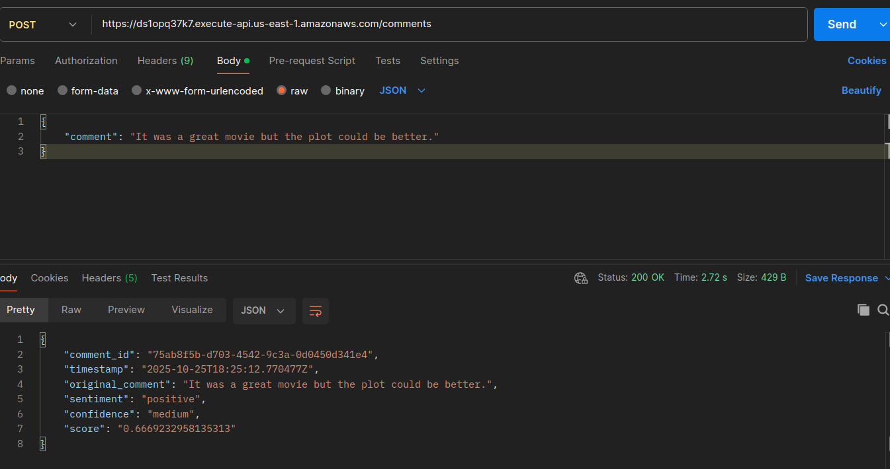
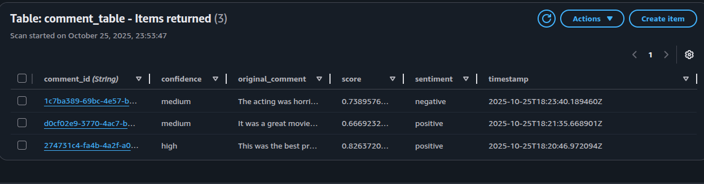

# End-to-End Serverless Sentiment Analysis Pipeline

This project is a complete, end-to-end application that performs real-time sentiment analysis on user comments. It features a custom-trained Scikit-learn machine learning model, deployed as a containerized microservice on **AWS ECS (Fargate)**, which is called by a serverless backend built with **AWS Lambda**, **API Gateway**, and **DynamoDB**.


## Architecture & Application Flow

The entire application is decoupled into distinct, single-responsibility services.

### Architecture Diagram

### Data Flow

1. **Frontend/API Client:** A user submits a comment through the static HTML/JS frontend or any **API Client**.

2. **API Gateway:** The frontend sends an HTTP `POST` request to an API Gateway endpoint (e.g., `/comments`).

3. **AWS Lambda:** The API Gateway triggers a Python-based Lambda function, passing the user's comment.

4. **ML Microservice (ECS):** The Lambda function makes an HTTP request to the sentiment microservice (a FastAPI app running in a Docker container on AWS ECS).

5. **Custom Model:** The microservice loads the custom-trained Scikit-learn model, analyzes the text, and returns a JSON response (e.g., `{"sentiment": "positive", "score": 0.98}`).

6. **DynamoDB:** The Lambda function receives this response, combines it with the original comment and a timestamp, and saves the complete object to a DynamoDB table for permanent storage.

7. **Response:** The Lambda function returns the complete JSON object to the frontend, which then displays the result to the user.


## Technology Stack


- **Machine Learning (Offline):**

    - **Python:** For model training.

    - **Scikit-learn:** For training a `LogisticRegression` model.

    - **Pandas:** For loading and cleaning the training data.

    - **NLTK:** For text preprocessing (stopwords, stemming).

- **ML Microservice (Backend):**

    - **FastAPI:** To serve the trained model as a fast, asynchronous REST API.

    - **Docker:** To containerize the FastAPI application.

    - **AWS ECR (Elastic Container Registry):** To host the private Docker image.

    - **AWS ECS (Elastic Container Service) on Fargate:** To run the container as a scalable, serverless microservice.

- **Serverless Pipeline (Backend):**

    - **AWS Lambda:** The core "glue" of the application, written in Python.

    - **AWS API Gateway:** To provide a public, serverless HTTP endpoint.

    - **AWS DynamoDB:** A NoSQL database for storing all submitted comments and their sentiments.

    - **AWS IAM:** To manage all the permissions between services.


## Setup and Deployment

Here are the steps to deploy this project from scratch.

### Prerequisites

- An [AWS Account](https://aws.amazon.com/ "null")

- [AWS CLI](https://aws.amazon.com/cli/ "null") configured

- [Python 3.9+](https://www.python.org/ "null")

- [Docker Desktop](https://www.docker.com/products/docker-desktop/ "null")


### Part 1: Train and Save the ML Model

1. Navigate to the `model_training` directory.

2. Install dependencies: `pip install -r requirements.txt`

3. Run the training script: `python train.py`

4. This will create `model.pkl` and `vectorizer.pkl`. (I have also pushed these two to the repository for reference. )

5. Copy these two `.pkl` files into the `sentiment_microservice/` directory.


### Part 2: Deploy the ML Microservice (AWS ECS)

1. **Build the Docker Image:**

    ```
    cd sentiment_microservice/
    docker build -t sentiment-service .
    ```

2. **Create an ECR Repository:**

    - Go to the AWS ECR console and create a **private** repository named `sentiment-service`.

    - Follow the "View push commands" to log in, tag your image, and push it to ECR.

3. **Create an ECS Cluster:**

    - Go to the AWS ECS console and create a new cluster.

    - Select the **"AWS Fargate (Serverless)"** template.

    - Name your cluster (e.g., `sentiment-service-cluster`).

4. **Create a Task Definition:**

    - In the ECS console, go to "Task Definitions" and create a new one.

    - Select **"AWS Fargate"**.

    - Name: `sentiment-task`

    - Image URI: Paste the ECR image URI you pushed in step 2.

    - Container Port: `8080` (as specified in the `Dockerfile`).

    - CPU/Memory: `default.

5. **Create a Service:**

    - Go back to your cluster and click "Create" under the "Services" tab.

    - **Task Definition:** Select `sentiment-task`.

    - **Service Name:** `sentiment-service`

    - **Networking:** Choose your VPC and subnets.

    - **IMPORTANT:** Under **"Public IP"**, select **"ENABLED"**.

    - **Security Group:** Create a new security group and add an **Inbound Rule** to allow **Custom TCP** on port `8080` from source `Anywhere (0.0.0.0/0)`.

    - Once the service is `RUNNING`, click the task and find its **Public IP**. Save this IP.



### Part 3: Deploy the Serverless Backend (Lambda + DynamoDB)

1. **Create DynamoDB Table:**

    - Go to the DynamoDB console and create a new table.

    - **Table Name:** `comments`

    - **Partition Key (Primary Key):** `comment_id` (Type: String)

    - Select **On-demand** capacity.

    - Save this table name.

2. **Create Lambda Function:**

    - Go to the AWS Lambda console and create a new function.

    - Name: `analyzerFunction` (i know it is a bad name)

    - Runtime: `Python 3.10`

    - Go to **Configuration > Permissions** and attach the `AmazonDynamoDBFullAccess` policy to its execution role.

    - Go to **Configuration > General configuration** and set the **Timeout** to `10 seconds`.

    - Go to **Configuration > Environment Variables** and add two:

        - `DYNAMODB_TABLE_NAME`: `comments`

        - `MICROSERVICE_URL`: `http://<YOUR_ECS_PUBLIC_IP>:8080/sentiment`

    - Paste the code from `lambda_function/lambda_handler.py` into the code editor and click **Deploy**.




### Part 4: Create the API Endpoint

1. Go to the **API Gateway** console.

2. Create a new **HTTP API** (the simpler, cheaper one).

3. **Integrations:**

    - Create a `POST` route for the path `/comments`.

    - Integrate this route with your `process-comment-lambda` function.

4. Keep the default `$default` stage.

5. After creation, find and copy the **Invoke URL**. This is your final public API endpoint.
    ![[Screenshot from 2025-10-26 00-25-19.png]]

## How to Test

You can use any API client (like Postman) or the provided frontend. To test with `curl`:

```
curl -X POST 'https://YOUR_API_GATEWAY_INVOKE_URL/comments' \
--header 'Content-Type: application/json' \
--data-raw '{
    "comment": "This is a fantastic project and it works perfectly!"
}'
```

### Example Success Response:

```
{
  "comment_id": "a1b2c3d4-e5f6-7890-a1b2-c3d4e5f67890",
  "timestamp": "2025-10-25T19:30:00.123Z",
  "original_comment": "This is a fantastic project and it works perfectly!",
  "sentiment": "positive",
  "score": "0.9987",
  "confidence": "high"
}
```



